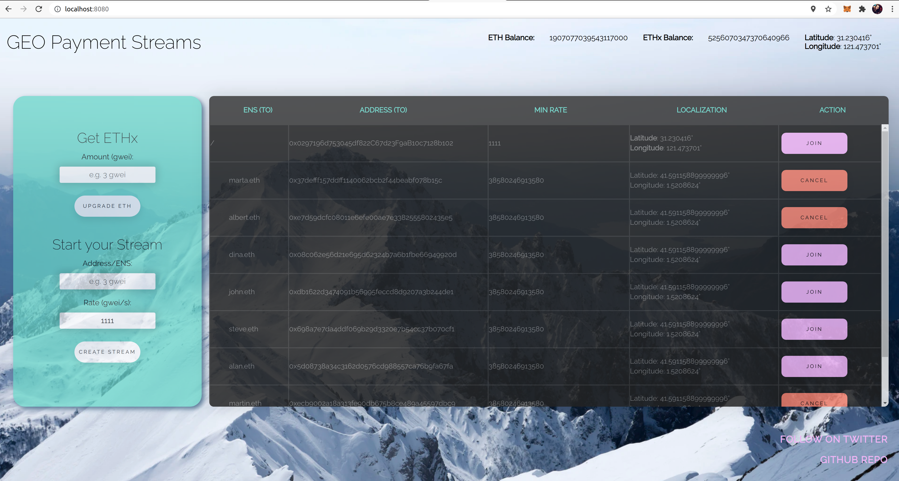

# geops
Geolocation Payment Streams - An application that can open and close payment streaming channels, based on the user location.

## Functionalities
- Get Geolocation using browser
- Upgrade ETH for ETHx Coins
- Start a new Stream
- List of Streams nearby (only frontend)
- Cancel current Streams
- Join existing Streams nearby

## Todo's
- Add Smart contract support for geo data